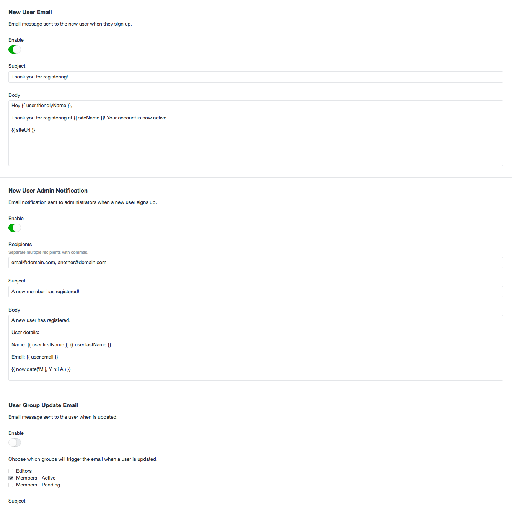

# User Notifications plugin for Craft CMS

Simple notifications for user signups.

## Installation

1. Place the `usernotifications` directory into your `craft/plugins` directory
2. Install the plugin in the Craft Control Panel under Settings > Plugins.
3. Navigate to the plugin settings to enable and customize emails.

## Settings

### New User Email

An email message that is sent to a new user when they sign up.

### New User Admin Notication

An email notification message that is sent to specified recipients with details about the new user signup.

### User Group Update Email

An email message that is set to the user when their member group assignment is changed. This is only triggered when the updated member groups include one or more of the selected groups.

This is helpful in a signup flow where new users are automatically added to a default member group with limited access (e.g. a 'pending' group) and a site admin assigns them a different group upon review (e.g. an 'active' group).

## User Notifications Changelog

### 1.0.0

* Initial release

Brought to you by [Surprise Highway](http://surprisehighway.com)